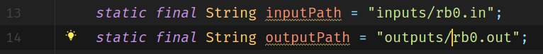
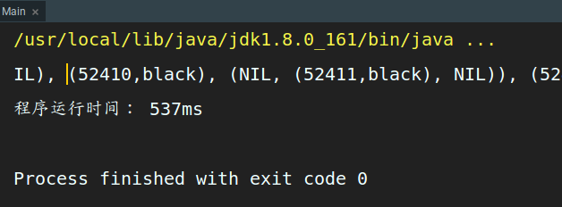

请看README.pdf  

## 已生成的输出文件
在outputs文件夹下  


## 运行方法
在src文件夹，RBTree.java文件的第13, 14行可以指定输入输出路径，如下图：



## lgn复杂度的验证
在src文件夹，RBTree.java文件的第 16 行可以指定是否为验证 lgn 的模式，如下图：


 
LGN的默认值是false．当LGN为false时，程序会输出结果到指定的输出文件中．   

当LGN改为true时，程序会输出最终的一次操作后的红黑树到命令行，并且输出此次运行时间．  

在 rb10.in　这一输出文件中，提供了带有100000次插入的测试用例，可以用来测试时间复杂度．   
结果如下：   

 

```!!!Warning!!!```: 不建议LGN为false的时候，使用　rb10.in　进行测试，因为数据量太大，产生的结果文件过大，且运行时间比较长　　　